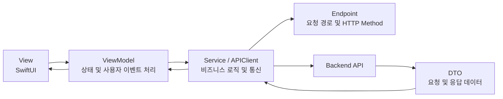
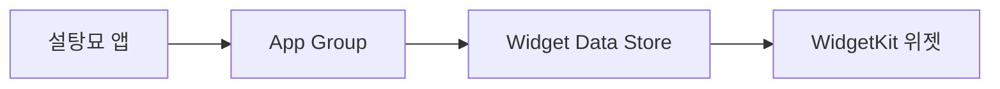

# Seoltang-myo-FE
서울여자대학교 졸업프로젝트 설탕묘 Frontend Repository

## 프로젝트 소개
**설탕묘(SugarCat)**는 여러 보호자가 함께 당뇨묘를 돌보는 환경에서 발생하는 기록 누락과 정보 공유의 어려움을 해결하기 위해 개발한 iOS 애플리케이션입니다.
혈당, 인슐린, 식사 기록을 통합 관리하고, 보호자 간 실시간 데이터 공유와 시각화 기능을 제공합니다.
SugarCat is an iOS application designed to help multiple caregivers collaboratively manage diabetic cats.
It enables blood glucose, insulin, and meal tracking, real-time data synchronization between caregivers, visualized health trends, and medication reminders.

## 주요 기능

### 소셜 로그인

- Apple 로그인
- Kakao 로그인
- Access Token 및 Refresh Token 기반 사용자 인증
- 인증 만료 시 토큰 재발급 및 세션 만료 처리

### 반려묘 정보 관리

- 반려묘 기본 정보 등록 및 수정
- 초대 코드를 활용한 사용자 초대
- 사용자 닉네임 등록 및 수정

### 혈당 관리

- 반려묘의 혈당 수치 기록
- 날짜별 혈당 기록 조회
- 일간·주간·월간 혈당 그래프 제공

### 식사 관리

- 반려묘의 식사량 기록
- 날짜별 식사 기록 조회

### 인슐린 관리

- 인슐린 투여 일정 확인
- 인슐린 투여 여부 기록
- 다음 관리 일정 안내

### 알림

- APNs 기반 푸시 알림
- 혈당·식사·인슐린 관련 알림 설정
- 알림 선택 시 관련 화면으로 이동

### 위젯

- WidgetKit 기반 홈 화면 위젯
- App Group을 통한 앱과 위젯 간 데이터 공유
- 다음 반려묘 관리 일정 표시

### 기록 저장

- 반려묘의 건강 기록을 PDF로 생성
- 생성된 PDF 미리보기 및 저장

### 네트워크 상태 대응

- 네트워크 연결 상태 모니터링
- 네트워크 연결 여부에 따른 화면 처리

## 앱 화면


## 기술 스택

### iOS

- Swift
- SwiftUI
- UIKit
- Combine

### 아키텍처 및 비동기 처리

- MVVM
- Swift Concurrency (`async/await`)

### 네트워크 및 인증

- URLSession
- Codable
- AuthenticationServices
- Kakao SDK

### 데이터 시각화 및 문서

- Swift Charts
- PDFKit

### 알림 및 위젯

- UserNotifications
- APNs
- WidgetKit
- App Groups

### 의존성 관리

- Swift Package Manager

## 아키텍처

설탕묘는 **MVVM(Model-View-ViewModel)** 패턴을 기반으로 구성되어 있습니다.



### View

- SwiftUI를 사용하여 화면을 구성합니다.
- 사용자 입력과 화면 이벤트를 ViewModel에 전달합니다.
- ViewModel이 관리하는 상태를 관찰하여 화면을 갱신합니다.

### ViewModel

- 화면에 표시할 상태를 관리합니다.
- 사용자 이벤트를 처리하고 Service에 필요한 작업을 요청합니다.
- 서버 응답 데이터를 화면에서 사용할 수 있는 형태로 변환합니다.

### Service 및 APIClient

- 백엔드 API와의 통신을 담당합니다.
- `URLSession`과 Swift Concurrency를 사용하여 비동기 요청을 처리합니다.
- 인증이 필요한 요청에 Access Token을 추가합니다.
- 토큰이 만료되면 재발급을 시도하고, 재발급할 수 없는 경우 세션 만료를 처리합니다.

### Endpoint

- 기능별 API 경로와 HTTP Method를 정의합니다.
- 인증, 사용자, 반려묘, 혈당, 식사, 인슐린 등의 Endpoint를 분리하여 관리합니다.

### DTO

- 서버에 전달할 요청 데이터와 서버에서 전달받은 응답 데이터의 구조를 정의합니다.
- `Codable`을 활용하여 JSON 데이터를 Swift 타입으로 변환합니다.

### 앱과 위젯의 데이터 공유



- App Group을 사용하여 메인 앱과 위젯이 데이터를 공유합니다.
- 건강 관리 기록을 기반으로 다음 관리 일정을 위젯에 표시합니다.

## 폴더 구조
```text
Seoltang-myo-FE
├── sugarcat
│   ├── DTO
│   │   ├── Auth
│   │   ├── Bloodsugar
│   │   ├── Cat
│   │   ├── Catcareinfo
│   │   ├── Graph
│   │   ├── Insulin
│   │   ├── Meal
│   │   ├── Notice
│   │   └── User
│   │
│   ├── Formatter
│   │   └── 날짜 및 D-Day 데이터 변환
│   │
│   ├── Main
│   │   ├── BloodSugar
│   │   │   ├── BloodSugarInput
│   │   │   └── BloodSugarMain
│   │   ├── Home
│   │   │   ├── Graph
│   │   │   ├── HomeHeader
│   │   │   ├── HomeInsulinCheck
│   │   │   └── Notice
│   │   ├── Meal
│   │   │   ├── MealInput
│   │   │   └── MealMain
│   │   └── MyPage
│   │       ├── MyPageTop
│   │       ├── NotificationSettingMyPage
│   │       └── PrintAndSave
│   │
│   ├── Network
│   │   ├── EndPoint
│   │   ├── APIClient.swift
│   │   └── NetworkMonitor.swift
│   │
│   ├── Notifications
│   │   ├── AppDelegate.swift
│   │   ├── NotificationDeviceTokenService.swift
│   │   ├── PushNotificationPayload.swift
│   │   └── PushNotificationRouter.swift
│   │
│   ├── OnBording
│   │   ├── CatInfo
│   │   ├── InfoInput
│   │   ├── Login
│   │   └── Nickname
│   │
│   ├── Style
│   │   ├── Assets.xcassets
│   │   └── 공통 UI 및 스타일
│   │
│   ├── Info.plist
│   ├── sugarcat.entitlements
│   └── sugarcatApp.swift
│
├── widget
│   ├── NextCareCalculator.swift
│   ├── NextCareWidgetStore.swift
│   ├── WidgetUpdater.swift
│   ├── widget.swift
│   └── widgetBundle.swift
│
├── sugarcat.xcodeproj
├── widgetExtension.entitlements
└── README.md
```

## 팀원 및 역할
- 서세린: 홈, 혈당, 식사 화면, 위젯, 알림 
- 조수현: 로그인, 온보딩, 마이페이지

## AppStore Link
https://apps.apple.com/kr/app/%EC%84%A4%ED%83%95%EB%AC%98/id6793892163
